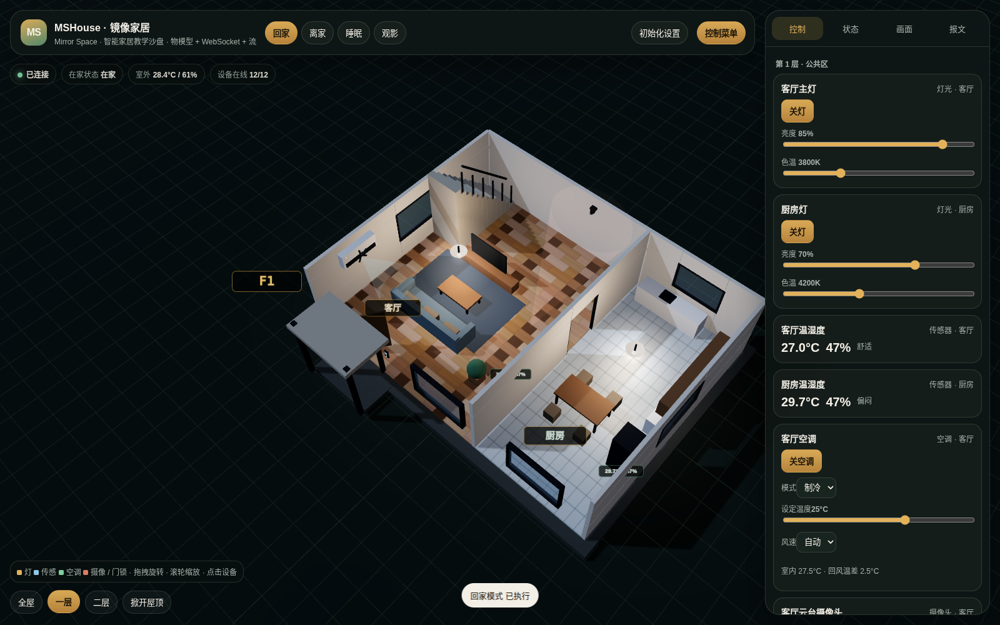
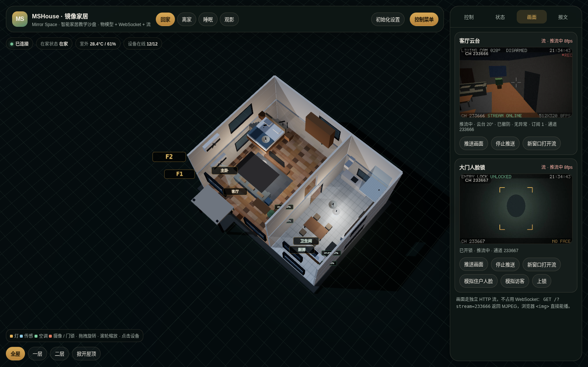
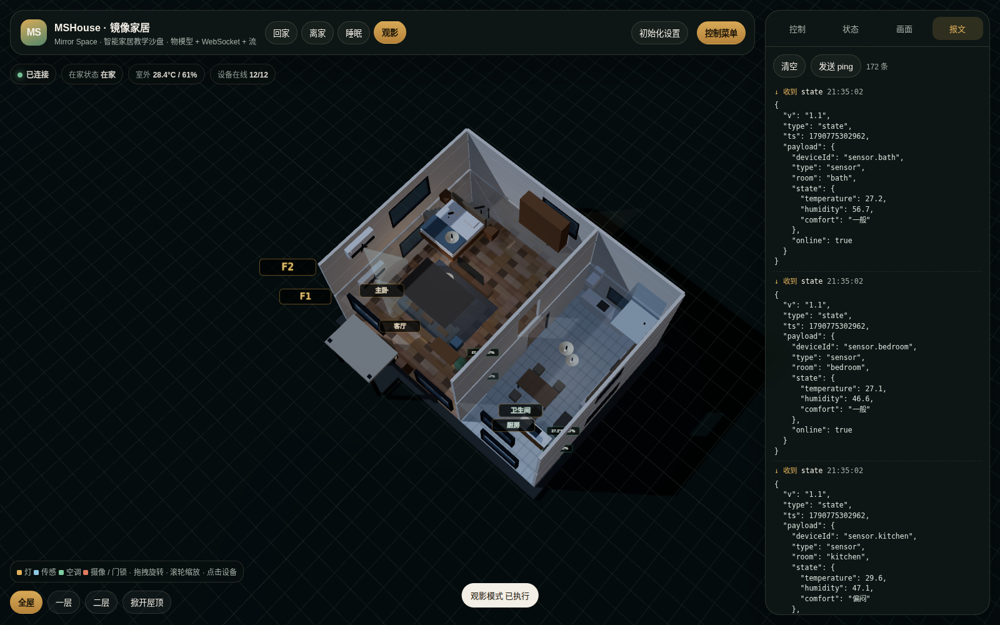

# MSHouse · 镜像家居

> **Mirror Space** 出品 · 智能家居数字孪生教学场景

一套面向**物联网 / 智能家居教学**的可运行数字孪生沙盘。两层小别墅、12 台智能设备、统一 WebSocket 协议、三维实时映射，外加设备控制 / 状态 / 事件日志 / 报文 / 画面五块教学面板。

> 设计目标不是"做个好看的 3D 房子"，而是**把物联网系统的分层讲清楚**：物模型 → 协议 → 网关 → 传输 → 呈现。每一层都可以单独替换，讲课时可以现场改一层给学生看。

| 全屋视图（二层楼板半透明） | 一层 + 回家模式 |
|---|---|
|  |  |

| 画面面板（HTTP MJPEG 流） | 报文面板（真实收发 JSON） |
|---|---|
|  |  |

---

## 一、快速开始

```bash
cd mshouse
npm install          # 只依赖 ws 与 jpeg-js
npm start            # 默认 http://localhost:8080
```

浏览器打开 `http://localhost:8080`。换端口：`PORT=9000 npm start`。

**只想接协议、不看三维？** 打开 `http://localhost:8080/demo.html` —— 一个单文件、零依赖的第三方客户端，可以直接改服务器地址。页面默认不连接，点「连接」才开始；设备分「感知 / 执行」两个标签：**感知**设备打勾后其报文才进入右侧报文面板（默认全部过滤），**执行**设备各自带一份可复制的报文样例，填进「发送报文」执行框即可原样下发。配套文档见 [`docs/INTEGRATION.md`](docs/INTEGRATION.md)（如何读传感器、如何控制设备、如何订阅视频流、报文格式、错误处理、动手练习）。

协议自检（会真实走一遍 WebSocket 与流通道的交互，也是"如何对接网关"的最小示例）：

```bash
npm run check        # 需先启动服务
node scripts/selfcheck.js ws://其他主机:8080/ws
```

**环境要求**：Node.js 18+；浏览器需支持 WebGL2 与 ES Module。Three.js 已内置在 `public/vendor/`，**完全离线可用**，不依赖任何 CDN。

---

## 二、目录结构与分层

```
mshouse/
├── shared/
│   └── model.js            ← ① 物模型层：设备目录、房间、场景、协议信封
├── server/
│   ├── index.js            ← ④ 传输层：HTTP 静态资源 + 流通道 + WebSocket 挂载
│   ├── gateway.js          ← ③ 网关层：设备影子、命令执行、场景引擎、遥测仿真
│   ├── stream.js           ← ④ 传输层：MJPEG 流通道（按需渲染 / 待机帧 / 背压）
│   └── render/
│       ├── raster.js       ← 服务端软渲染器（投影 / 填充 / 光照 / OSD 点阵字）
│       └── scenes.js       ← 画面合成：客厅实景、门厅、待机画面
├── public/
│   ├── index.html
│   ├── demo.html           ← 第三方客户端示例（单文件零依赖，可改服务器地址）
│   ├── css/app.css
│   ├── vendor/             ← 本地内置 three.module.js + OrbitControls.js
│   └── js/
│       ├── main.js         ← 装配层：唯一同时认识"三维"和"界面"的文件
│       ├── scene.js        ← ⑤ 呈现层：三维孪生场景（几何/设备视图/动画）
│       ├── ui.js           ← ⑤ 呈现层：面板 DOM（不认识 WebSocket）
│       └── protocol.js     ← ② 协议层：信封封装
├── docs/
│   └── INTEGRATION.md      ← 客户端接入指南（协议详解 + 示例 + 练习）
└── scripts/selfcheck.js    ← 协议自检 / 对接示例
```

分层与数据流（注意画面走的是**独立于 WebSocket 的第二条路**）：

```
  浏览器
  ┌──────────────────────────────────────────────────────────┐
  │    ui.js (面板)            scene.js (三维)                │
  └──▲────────────▲───────────────────────▲─────────────────┘
     │ 状态/事件   │ 状态                   │ 像素（MJPEG）
  ┌──┴────────────┴───────┐        ┌───────┴─────────────────┐
  │     main.js  装配层    │        │    │
  └──▲────────────────┬───┘        └───────▲─────────────────┘
     │ 下行 state/event│ 上行 command/scene │
  ═══╪════════════════╪════════════════════╪═══════════════════
     │                │                    │
  ┌──┴────────────────┴───┐        ┌───────┴─────────────────┐
  │  gateway.js  设备影子  │───────▶│  stream.js  MJPEG 通道   │
  │  命令 · 场景 · 遥测 · 广播│ 驱动   │  按需渲染 · 待机帧 · 背压 │
  └──────────▲────────────┘        └───────▲─────────────────┘
             │                             │
  ┌──────────┴─────────────────────────────┴─────────────────┐
  │              shared/model.js  物模型                      │
  └──────────────────────────────────────────────────────────┘
```

**关键约束（讲课时可以强调）**：
- `ui.js` 和 `scene.js` 都**不认识 WebSocket**，只提供"喂状态进来、抛意图出去"的接口。换掉通信方式，这两层不用动。
- `main.js` 是唯一的装配点。想换 UI 框架，只改这一个文件和 `ui.js`。
- 物模型是**前后端共享**的同一份文件，设备清单只有一处定义。
- **信令与像素分离**：WebSocket 只负责"该不该推流、流地址是什么"，像素走独立 HTTP 连接。这是真实视频系统的通用做法。

---

## 三、物模型（设备清单）

| 设备 ID | 名称 | 房间 | 类型 | 能力 |
|---|---|---|---|---|
| `light.living` | 客厅主灯 | 客厅 | light | 开关 / 亮度 / 色温 |
| `light.kitchen` | 厨房灯 | 厨房 | light | 开关 / 亮度 / 色温 |
| `light.bedroom` | 卧室灯 | 主卧 | light | 开关 / 亮度 / 色温 |
| `light.bath` | 卫生间灯 | 卫生间 | light | 开关 / 亮度 / 色温 |
| `sensor.living` | 客厅温湿度 | 客厅 | sensor | 只读遥测 |
| `sensor.kitchen` | 厨房温湿度 | 厨房 | sensor | 只读遥测 |
| `sensor.bedroom` | 卧室温湿度 | 主卧 | sensor | 只读遥测 |
| `sensor.bath` | 卫生间温湿度 | 卫生间 | sensor | 只读遥测 |
| `ac.living` | 客厅空调 | 客厅 | ac | 开关 / 模式 / 设定温度 / 风速 |
| `ac.bedroom` | 卧室空调 | 主卧 | ac | 开关 / 模式 / 设定温度 / 风速 |
| `camera.living` | 客厅云台摄像头 | 客厅 | camera | 开关 / 360° 云台 / 推流（CH `233666`）/ 布防 |
| `lock.entry` | 大门人脸锁 | 门厅 | lock | 上锁 / 开锁 / 人脸识别 / 推流（CH `233667`） |

**设计要点**：传感器是**只读**的，网关会拒绝写命令（自检里有这一项）。这模拟了真实物联网中"感知设备不可控"的约束，也逼着学生区分**遥测（telemetry）**和**控制（command）**两类数据流。

---

## 四、通信协议

统一信封，`v` 字段留作版本演进：

```json
{
  "v": "1.1",
  "type": "command",
  "id": "cmd-7",
  "ts": 1735000000000,
  "payload": { "deviceId": "light.living", "action": "set", "params": { "brightness": 42 } }
}
```

### 消息类型

| 方向 | type | 说明 |
|---|---|---|
| S→C | `hello` | 建链握手，返回网关标识与协议版本 |
| S→C | `snapshot` | **全量**设备影子（含场景定义、通道状态与最近事件） |
| S→C | `state` | **增量**状态推送（单设备） |
| S→C | `event` | 业务/安防事件（含 `level`） |
| S→C | `scene` | 场景切换通知 |
| S→C | `video` | **流信令**：通道名 / 是否推流 / 云台角 / 观众数 / 帧率（见第七节） |
| S→C | `setup` | 初始化完成广播：位置 + 室外预报 |
| C→S | `setup` | 口令 + 经纬度，网关拉预报后改写室外温度 |
| S→C | `ack` | 命令回执，`ref` 关联请求 `id` |
| S→C | `error` | 协议级错误（`BAD_JSON` / `UNKNOWN_TYPE`） |
| C→S | `command` | 设备控制 |
| C→S | `scene` | 场景切换 |
| C→S | `ping` / `snapshot` | 心跳 / 主动拉全量 |

### 命令动作

| 设备类型 | action | params 示例 |
|---|---|---|
| light | `set` / `on` / `off` / `toggle` | `{ power: true, brightness: 80, colorTemp: 3800 }` |
| ac | `set` / `on` / `off` / `toggle` | `{ mode: "cool", targetTemp: 25, fan: "auto" }` |
| camera | `set` / `pan` / `nudge` / `arm` / `stream` | `{ pan: 275 }`、`{ delta: 15 }`、`{ armed: true }`、`{ on: true }` |
| lock | `lock` / `unlock` / `face` / `stream` | `{ faceId: "resident.lin" }`、`{ on: true }` |
| sensor | — | 只读，写入返回 `ok:false` |

### 两种状态同步策略

- **全量 `snapshot`**：建链时下发一次；场景切换后补一次；前端每 60s 主动拉一次做兜底对账。
- **增量 `state`**：任何状态变化即时广播，只带变化后的完整设备状态。

课堂上可以让学生故意"丢包"（在 `main.js` 里注释掉 `state` 处理），观察画面失同步，再靠 60s 的 `snapshot` 兜底恢复——这是理解**最终一致性**的好例子。

---

## 五、场景模式

场景是**服务端的批量设备操作**，不是前端宏。切场景后网关广播 `scene` + 全量 `snapshot`，保证多客户端（比如老师端和学生端）看到同一状态。

| 场景 | 客厅灯 | 厨房灯 | 卧室灯 | 卫生间灯 | 客厅空调 | 卧室空调 | 摄像头 | 门锁 |
|---|---|---|---|---|---|---|---|---|
| **回家** | 85% / 3800K | 70% / 4200K | 关 | 关 | 制冷 25°C | 关 | 撤防 · 推流 | 开锁 |
| **离家** | 关 | 关 | 关 | 关 | 关 | 关 | **布防** · 云台归零 | 上锁 |
| **睡眠** | 关 | 关 | **8% / 2700K 夜灯** | 关 | 关 | 制冷 26°C 低风 | 布防 · 转 180° | 上锁 |
| **观影** | 12% / 2700K | 关 | 关 | 关 | 制冷 24°C 低风 | 关 | 停推流 | — |

键盘 `1` `2` `3` `4` 可快速切场景，`F` 循环切换楼层视图。

---

## 六、初始化设置与室外边界

顶栏「初始化设置」要求口令（教学默认 `villa`，定义在 `shared/model.js` 的 `SETUP_PASSWORD`）。通过后网关向 Open-Meteo 拉取该经纬度的当前气温、湿度和天气现象，写入 `outdoor`，并按室外温度重播种室内传感器与空调回风。之后遥测仍围绕这个初值缓慢漂移。

```json
{ "type": "setup", "payload": { "password": "villa", "lat": 30.2741, "lon": 120.1551, "name": "杭州西湖" } }
```

错误口令只回 `ack.ok=false`，不改任何影子。

---

## 七、视频传输：HTTP 流 + WebSocket 信令

这是本项目的**教学重点之一**。真实智能家居里，视频走 RTSP / WebRTC / MSE，**不会**走设备控制那条 WebSocket。本项目把这个原则落进了实现——**信令与像素彻底分离**。

### 两条通道，各管各的

| | 走什么 | 传什么 |
|---|---|---|
| **信令** | WebSocket `/ws` | `video` 消息：通道名、是否在推流、云台角度、布防状态、识别结果、观众数、帧率 |
| **像素** | HTTP 长连接 | `GET /?stream=<通道名>` → `multipart/x-mixed-replace`（MJPEG） |

浏览器不需要 MSE、不需要 WebRTC、不需要任何解码库，一个原生标签就能播：

```html

```

### 通道分配

| 通道名 | 设备 | 画面内容 |
|---|---|---|
| `233666` | `camera.living` | 客厅云台视角：电视、茶几、沙发、地毯、窗、绿植 |
| `233667` | `lock.entry` | 门厅人脸锁视角：门口、门扇、识别状态 |

`GET /streams` 返回全部通道的当前状态：

```json
{ "streams": [ { "channel": "233666", "deviceId": "camera.living",
                 "live": false, "viewers": 0, "fps": 2, "idleFps": 2 } ] }
```

### 怎么开始推流

推流由**设备指令**控制，不由"有没有人看"控制：

```json
{ "v": "1.1", "type": "command", "id": "cmd-9", "ts": 1735000000000,
  "payload": { "deviceId": "camera.living", "action": "stream", "params": { "on": true } } }
```

网关回 `ack`，其中带上通道的最新状态：

```json
{ "type": "ack", "ref": "cmd-9", "payload": { "ok": true,
  "stream": { "channel": "233666", "live": true, "viewers": 1, "fps": 8 } } }
```

### 三个设计细节（都值得在课上展开）

1. **通道常在线，待机不黑屏。** 通道在没有推流时不断开，而是推 `STANDBY` 待机画面（低帧率）。`` 的连接一直挂着，指令一到立刻切换成实景，观众端**无需刷新页面**——这是"流"相对"轮询帧"的关键优势。
2. **按需渲染，一个通道只画一次。** 画面由服务端软光栅化生成，CPU 开销不低。所以只有存在订阅者时才启动渲染定时器；一个通道渲染一帧后广播给所有观众。没有观众时定时器停止，帧率降到 `idleFps = 2`。
3. **背压保护。** 客户端读得慢时（`writableLength > 2MB`）直接丢帧，而不是无限堆积内存。真实视频服务必须做这件事。

### 像素从哪来

画面**不是**前端三维场景的截图，而是服务端独立渲染的：`server/render/raster.js` 是一个纯 JS 软光栅器（透视投影 + 背面剔除 + 画家算法 + 朗伯光照），`scenes.js` 用它搭出客厅与门厅，编码成 JPEG 后推入流。这样即使客户端完全不跑 WebGL（比如树莓派上的看板），也能拿到画面。

客厅摄像头与门厅的渲染机位与三维场景里的云台朝向是对齐的——转云台、开关灯、切场景，流里的画面同步变化。

### 换成真实摄像头

**协议层与前端一行都不用改。** 把 `server/render/` 的渲染源换成"RTSP/ONVIF 拉流 → JPEG 转码"的适配器即可，`stream.js` 的通道机制、信令格式、`` 播放全部保持原样。这正是把信令与像素分开的收益。

---

## 八、三维场景实现

### 建筑与坐标

- 外轮廓 12m × 9m，层高 3.0m，楼板 0.22m，墙厚 0.14m。原点在建筑中心，`+Y` 向上，`+Z` 为正面（入户门一侧）。
- 一层：客厅（x ∈ [-6, 1.5]）+ 厨房（x ∈ [1.5, 6]），隔墙留门洞，楼梯靠后墙通二层。
- 二层：主卧 + 卫生间，楼板在楼梯位置开洞。

### 带门窗洞的墙怎么建

没有引入 CSG 库（避免重依赖）。做法是**矩形分解**：把墙沿长度和高度方向在洞口边界处切分，逐格判断中心是否落在洞内，跳过洞内格子，其余生成 Box。见 `decompose()`。

这样得到的墙是纯 Box 拼装，**顶点数极低**（整场景约 6600 三角面），软件渲染都能流畅跑——很适合学生笔记本。

### 视图模式

| 模式 | 行为 |
|---|---|
| **全屋** | 两层都显示，二层楼板材质转为 14% 透明度（否则一层完全被挡住），屋顶按"掀开屋顶"开关决定 |
| **一层** | 隐藏二层整体，俯视一层 |
| **二层** | 隐藏一层整体，呈"爆炸视图"效果 |
| **掀开屋顶** | 屋顶 + 正面外墙一起显示/隐藏，切到"外观模式"；此时房间标签自动隐藏 |

### 设备视图与动画

每类设备是一个 `update(state)` + `tick(dt, time)` 的视图对象，注册进 `deviceViews`：

| 设备 | 视觉映射 |
|---|---|
| 灯 | 点光源强度 + 灯罩自发光 + 辉光 Sprite；**色温经 `kelvinToColor()` 映射为真实色偏**，2700K 暖黄 → 6500K 冷白 |
| 温湿度 | 墙装小盒 + 状态 LED（过热转橙、偏冷转蓝）+ 悬浮数值标签 |
| 空调 | 风扇转速随风速档位、导风口气流锥体透明度随开关渐变、制冷蓝 / 制热橙 |
| 摄像头 | 云台 `rotation.y` 按 `pan` 缓动旋转；机位与服务端流的渲染机位对齐，流里看到的朝向与三维里的云台一致 |
| 门锁 | 门扇绕合页旋转（上锁闭合 / 开锁内开），面板 LED 红/绿/琥珀三态，识别时扫描环脉冲 |

所有动画都用**指数缓动**（`lerp(cur, target, dt * k)`）而非固定帧步进，因此在不同帧率下表现一致——顺带可以讲"为什么动画要乘 dt"。

### 交互

- 拖拽旋转 / 滚轮缩放 / 右键平移（OrbitControls）
- 点击设备：三维高亮 + 右侧面板自动定位到该设备卡片
- 点击面板卡片标题：三维相机平滑推近到该设备
- 房间名与设备数值用 Canvas Sprite 实现，不依赖 `CSS2DRenderer`，且 `depthTest:false` 保证永远可读

---

## 九、五个教学面板

| 面板 | 内容 |
|---|---|
| **控制** | 按楼层分组的设备卡片。灯有开关/亮度/色温，空调有模式/温度/风速，云台有角度滑杆与 ±15° 微调，门锁有开锁/上锁/模拟人脸 |
| **状态** | 全部设备的关键读数速览 + **事件日志**（info / ok / warn / alarm 四级着色） |
| **画面** | 两路 MJPEG 流：客厅云台（CH `233666`）与大门人脸锁（CH `233667`）。每路带「推送画面 / 停止推送 / 新窗口打开」按钮，并显示通道名、观众数与帧率 |
| **报文** | **原始 WebSocket 报文收发流**（↑发出 / ↓收到，含完整 JSON）。流信令只在状态变化时广播，不会刷屏 |

"报文"面板是这套东西的教学杀手锏：点一下灯，学生能同时看到 3D 变化和**屏幕上真实飞过的 JSON**，协议不再是抽象概念。

---

顶栏「控制菜单」可收起右侧整块面板，方便看全屋；状态记在 `localStorage`，刷新后保持。

## 十、课堂实验建议

1. **看懂协议**：打开"报文"面板，点客厅灯，找出 `command` / `ack` / `state` 三条报文，说明 `ref` 字段的作用。
2. **只读约束**：用"报文"面板手动改一条传感器写命令发出去，观察网关拒绝。
3. **最终一致性**：临时注释 `main.js` 里 `case "state"` 的处理，操作设备，观察画面失同步；等 60s 全量快照到达后自动恢复。
4. **加一台设备**：在 `shared/model.js` 的 `DEVICE_CATALOG` 里加一条（比如 `light.balcony`），在 `gateway.js` 的 `_defaultState()` 里给初值，再在 `scene.js` 的 `buildDevices()` 里加一行 `_lightDevice(...)`。三处改动，十分钟。
5. **改场景**：在 `gateway.js` 的 `_applyScene()` 里给"回家"模式加一条"打开厨房灯"，观察全端同步。
6. **观察流与信令分离**：同时开两个浏览器窗口都连 `/?stream=233666`，看 `/streams` 里 `viewers` 变成 2、帧率不变——一个通道只渲染一次，广播给所有观众。
7. **改画面看效果**：改 `server/render/scenes.js` 里的一处家具颜色或机位，重启后刷新流，说明画面是服务端生成的、与前端三维无关。
8. **接真实设备**：见下节。

---

## 十一、扩展指南

### 接入真实设备（MQTT 为例）

网关的 `Gateway` 类已经把"设备影子"抽象好了。接真实硬件只需在 `server/` 下加一个适配器：

```js
// 伪代码：把 MQTT 上报映射成 state 广播，把 command 映射成 MQTT publish
mqtt.subscribe("mshouse/+/state");
mqtt.on("message", (topic, buf) => {
  const device = this.devices.get(idFromTopic(topic));
  Object.assign(device.state, JSON.parse(buf));
  this.broadcast(envelope("state", { deviceId: device.id, state: device.state }));
});
```

**前端一行都不用改**——这正是分层的目的。

### 接入真实视频

把 `server/render/` 的渲染源换成 RTSP 拉流 + JPEG 转码适配器，`stream.js`、信令格式与前端都不用动。见第七节。

### 加房间 / 改户型

`scene.js` 顶部的尺寸常量与 `_buildFloor1()` / `_buildFloor2()` 是唯一的户型定义处，`shared/model.js` 的 `ROOMS` 与之对应。

---

## 十二、已知取舍

- **画面由服务端软渲染生成**，不是真实摄像机。转云台、开关灯、切场景，流里的画面会同步变化；换成真实 RTSP 源只需替换渲染适配器。
- **MJPEG 不是最优的编码方式**（带宽比 H.264 高），但胜在零依赖、`` 直接可播，适合教学。生产环境应换 WebRTC / HLS。
- **初始化口令是明文教学口令**（默认 `villa`）。真实系统应在服务端做哈希校验，并限制尝试次数。
- **网关是单进程内存态**，重启即回到"离家模式"。真实项目需要持久化设备影子（如 Redis），这里为了让学生能读到完整代码而省略。
- **无鉴权**。真实系统需要设备证书 / Token，`ws` 的升级请求里加 token 校验是常见做法，留作扩展练习。
- **阴影只由一盏平行光投射**，房间内的点光源不投影，以控制软件渲染下的开销。
- 光照调校基于黄昏氛围（月光 + 室内暖光），白天场景需要调 `scene.background` 与平行光强度。

---

## 十三、许可

教学示例代码，可自由用于课程与二次开发。

---

**MSHouse · 镜像家居** — Mirror Space
