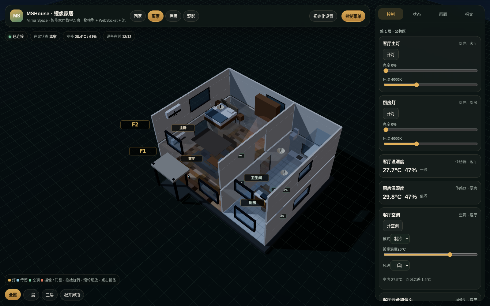
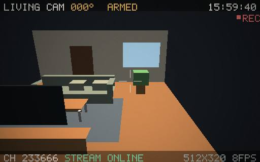
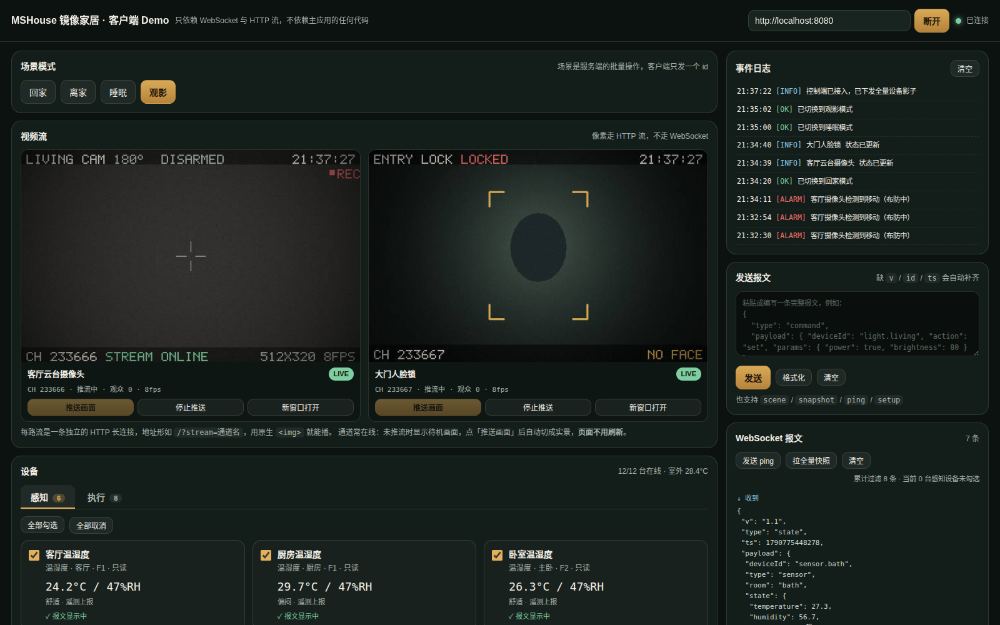

# MSHouse 镜像家居

**Mirror Space** 旗下的智能家居数字孪生教学场景 · Python 后端版 **v1.0**

> 一栋两层小别墅的数字孪生：一层是客厅与厨房，二层是卧室与卫生间。
> 12 台设备通过统一 WebSocket 协议控制与上报状态，浏览器中可实时查看摄像头与人脸锁画面，
> 并支持回家、离家、睡眠、观影等场景模式。适合用来讲解**物联网通信、设备联动和数字孪生**。



---

## 快速开始

```bash
pip install -r requirements.txt
python -m server.main
```

打开 <http://localhost:8080> 即可。默认端口 8080，可用 `PORT` 环境变量覆盖。

跑一遍协议自检（31 项，含流通道端到端）：

```bash
python scripts/selfcheck.py                       # 默认 ws://127.0.0.1:8080/ws
python scripts/selfcheck.py ws://host:port/ws     # 指定地址
```

> **必须单 worker 运行。** 流通道订阅者与设备影子都在进程内存里，多 worker 会让每个进程
> 各持一份状态。渲染已经丢到线程池，不需要靠多进程扩吞吐（详见下面「并发模型」）。

---

## 技术栈

| 层 | 选型 | 说明 |
|---|---|---|
| HTTP / WebSocket | **FastAPI + uvicorn** | 一个进程同时提供静态资源、WebSocket 与 MJPEG 长连接 |
| 软光栅渲染 | **numpy + Pillow** | 多边形/直线走 Pillow 的 C 实现，全屏滤镜走 numpy |
| JPEG 编码 | **Pillow** | 实测比 Node 版的 jpeg-js 快约 30 倍 |
| 天气预报 | **httpx** | 初始化设置时取 Open-Meteo 实况 |
| 前端 | **Three.js（原样复用）** | 浏览器侧一行未改，见下文「前端为什么不用改」 |

---

## 目录结构

```
mshouse-py/
├── server/
│   ├── main.py            FastAPI 入口：静态资源 / MJPEG / WebSocket / 健康检查
│   ├── gateway.py         设备影子、命令执行、场景联动、遥测、流信令
│   ├── stream.py          StreamHub：MJPEG 通道、按需推流、背压丢帧
│   ├── model.py           物模型与协议常量（★ 唯一真源）
│   └── render/
│       ├── raster.py      软光栅器：投影 / 剔除 / 画家算法 / 光照 / 点阵 OSD
│       └── scenes.py      画面合成：客厅实景、门厅人脸锁、待机画面
├── public/                前端（Three.js 场景 + UI + 客户端 demo）
├── shared/model.js        前端物模型（由 scripts/export_model.py 生成，勿手改）
├── scripts/
│   ├── export_model.py    从 model.py 生成 shared/model.js
│   └── selfcheck.py       协议自检（31 项）
├── integrations/
│   └── ha_bridge.py       Home Assistant 桥接（MQTT Discovery，零侵入）
└── requirements.txt
```

---

## 架构：四层分离

```
┌──────────────────────────────────────────────────────────┐
│  浏览器（Three.js 三维场景 + 控制面板）                    │
│    · WebSocket 收发报文  ·     │
└───────────────┬──────────────────────┬───────────────────┘
                │ /ws                  │ /?stream=<通道>
┌───────────────▼──────────┐  ┌────────▼────────────────────┐
│ gateway.py               │  │ stream.py  (StreamHub)      │
│ 设备影子 / 命令 / 场景    │  │ 通道注册 / 帧循环 / 广播     │
│ 遥测 / 流信令            │  │ 待机↔实景 / 背压丢帧         │
└───────────────┬──────────┘  └────────┬────────────────────┘
                │                      │ render()
┌───────────────▼──────────────────────▼────────────────────┐
│ render/  软光栅：几何 → 投影 → 着色 → JPEG                 │
│ model.py 物模型：设备目录 / 场景 / 报文信封                 │
└───────────────────────────────────────────────────────────┘
```

分层原则：**渲染层不认识协议，网关不认识像素**。
`render/` 只吐出一张 Raster；`stream.py` 只认识「通道 / 订阅者 / JPEG」；
`gateway.py` 只认识设备与报文。要换掉任何一层都不影响另外两层。

---

## 视频流：信令与像素分离

这是整个项目最重要的一个设计决定：

- **信令走 WebSocket**：只推「通道名 / 是否在推 / 云台角度 / 订阅数」，状态**变化时**才发一条；
- **像素走 HTTP 流**：`GET /?stream=<通道名>` 返回 `multipart/x-mixed-replace`，
  浏览器 `` 原生就能播，不需要 MSE / WebRTC。

| 设备 | 通道名 | 地址 |
|---|---|---|
| 客厅云台摄像头 | `233666` | `/?stream=233666` |
| 大门人脸锁 | `233667` | `/?stream=233667` |

几个由此带来的好处：

1. **前端与后端解耦**：浏览器只认 WebSocket 报文格式和 MJPEG 这两个标准契约。
   这正是本次把后端从 Node 换成 Python 后，**前端一行都不用改**的原因。
2. **待机帧常在线**：通道一直有画面（未推流时是 `STANDBY`），`` 连接不刷新，
   指令一到立刻切实景 —— 与真实摄像头「未取流」的状态一致。
3. **按需渲染**：只有存在订阅者时才启动帧循环；一个通道渲染一次广播给所有观众，
   CPU 不随观看人数增长。
4. **真实设备替换成本低**：海康/大华的 `/video.cgi`、`/mjpg/video.mjpg` 用的就是这套协议。

下面是 **Python 版实际运行时**从 `233666` 通道直接抽下的原始帧（软光栅实时渲染，不是视频文件）：



推送画面的指令：

```json
{ "v": "1.0", "type": "command", "id": "ui-1", "payload": {
    "deviceId": "camera.living", "action": "stream", "params": { "on": true } } }
```

---

## Python 实现要点

### 1. 渲染层：不能照直翻译

原 Node 版的 `Raster.px()` 是**一个像素一个像素地写 Buffer**。这套写法在 Python 里会慢
20 倍以上，直接翻译连 8fps 都保不住。实测数据（512×320）：

| 操作 | 纯 Python 逐像素 | 改用 C 实现 | 提速 |
|---|---|---|---|
| 全屏暗角 | 78.61 ms | numpy 向量化 0.40 ms | **196×** |
| 200 个多边形填充 | 27.73 ms | Pillow ImageDraw 0.48 ms | **57×** |
| JPEG 编码 | — | Pillow 0.26 ms（对比 jpeg-js 15.84 ms） | **61×** |

所以渲染层是**重写**而不是翻译：

- 多边形 / 椭圆 / 直线 / 矩形 → `ImageDraw`，不透明走普通模式，半透明走 `"RGBA"` 模式由 Pillow 混合；
- 噪点 / 暗角 → `ImageChops.add` / `multiply`（C 实现），噪点用「中性值 128 + offset 减回」的技巧实现加法；
- 点阵文字 → 预生成字形掩膜缓存 + `Image.paste`；
- 算法本身（透视投影、背面剔除、画家算法、朗伯光照）与原版逐行对齐。

> **踩过的坑**：不要试图让 numpy 数组和 `PIL.Image` 共享同一块内存。
> Pillow 12 的 `Image.fromarray()` 会拷贝数据，`np.asarray(img)` 又是只读的 ——
> 两边各写各的，结果是「画了半天，读出来还是空白」。本项目只保留一块画布（`PIL.Image`）。

### 2. 并发模型：asyncio + 线程池 + 出站队列

三件事需要同时跑：WebSocket 报文、MJPEG 帧循环、周期遥测。Python 这边有两个坑：

- **渲染是 CPU 密集任务**。直接写在协程里会卡死整个事件循环（WebSocket 消息会延迟几秒才回）。
  所以渲染与编码统一通过 `asyncio.to_thread()` 丢到线程池 —— numpy / Pillow 计算时会释放 GIL，
  既不会阻塞事件循环，也能真正并行。
- **广播是协程，但状态机是同步的**。`Node` 里 `ws.send()` 直接调用即可；Python 里若 `await`，
  会把整条调用链染成 async。这里给每个客户端配一个**出站队列**：同步逻辑只管 `put_nowait`
  （队列满就丢最旧的），由每个连接自己的发送协程负责真正写出去。业务逻辑保持同步写法，还自带背压。

背压方面，每个流订阅者一个有界队列（`maxsize=2`），队列满了直接丢帧 ——
等价于 Node 版判断 `res.writableLength` 后跳过的策略。

### 3. 物模型同源：Python 当唯一真源

Node 版可以把同一个 `shared/model.js` 既 import 给后端、又托管给浏览器。
Python 后端没法给浏览器吐 ES Module，如果手工再抄一份 JS，两边必然漂移。

这里把 **`server/model.py` 当作唯一真源**，用生成器产出前端文件：

```bash
python scripts/export_model.py     # 重新生成 shared/model.js
```

改了设备、通道名或场景之后跑一次即可。生成的 `shared/model.js` 顶部有醒目的
「请勿手工修改」标注，从机制上避免了两份物模型打架。

---

## 与 Node 版的性能对比

同样的画面参数、同样的 512×320 分辨率：

| 项目 | Node 版 | Python 版 | 对比 |
|---|---|---|---|
| 客厅实景渲染 | 5.73 ms | 2.68 ms | 2.1× 快 |
| 待机画面渲染 | 4.33 ms | 1.05 ms | 4.1× 快 |
| JPEG 编码 | 15.84 ms | 0.56 ms | 28× 快 |
| **端到端 / 帧** | **21.02 ms** | **3.24 ms** | **6.5× 快** |
| 8fps 双通道 CPU 占用 | ~69% | ~10% | — |

有意思的是：Node 版的瓶颈其实**不在渲染，而在 JPEG 编码**（占端到端的 75%）。
Python 这边用 Pillow（C 实现）把它压到 0.5 ms 以内，所以整体反而更快。

---

## 协议速览

所有报文共用一个信封：`{ v, type, ts, payload }`，命令类报文额外带 `id` / `ref` 用于关联。

| 方向 | type | 说明 |
|---|---|---|
| S→C | `hello` | 建链握手，含协议版本与网关标识 |
| S→C | `snapshot` | 全量设备影子（建链即推，场景切换时重推） |
| C→S | `command` | 设备控制：`{ deviceId, action, params }` |
| S→C | `ack` | 命令回执，含 `state` 与 `stream` 通道信息 |
| S→C | `state` | 单设备状态变更推送 |
| C→S | `scene` | 场景切换：`{ sceneId }` |
| S→C | `scene` | 场景切换广播 |
| S→C | `video` | **流信令**（不含像素），只在状态变化时推 |
| S→C | `event` | 事件日志（安防告警、场景切换等） |
| C→S | `setup` | 初始化设置：口令 + 经纬度 → 按天气预报初始化室外温度 |
| C→S/S→C | `ping` / `pong` | 心跳 |

完整的接入指南（含可复制的报文样例）见 **[docs/INTEGRATION.md](docs/INTEGRATION.md)**。

---

## 客户端 Demo

`public/demo.html` 是一个**零依赖的单文件客户端**：它不引用主应用的任何 JS/CSS，
只通过 WebSocket 与网关对话，用来证明「三维场景」和「设备协议」是两层。



它包含「感知 / 执行」两个标签、报文过滤、报文样例与执行框，以及两路视频流播放卡片。

---

## 前端为什么不用改

前端 3372 行（Three.js 场景 1051 行、UI 572 行、demo 1039 行、其余为 HTML/CSS）
在本次后端语言切换中**一行未改**。原因就是「信令与像素分离 + 标准 MJPEG」这两个契约：

- 浏览器只认 WebSocket 的 JSON 报文格式，不关心服务端用什么语言生成；
- 浏览器只认 `multipart/x-mixed-replace` 这个 HTTP 标准，`` 原生解码；
- 静态资源路径（`/`、`/shared/`）保持一致即可。

换成任何后端语言，这个结论都成立 —— 这也是当初分层设计的回报。

---

## 教学建议

1. **先跑起来**：`python -m server.main`，点「推送画面」，看画面从待机切实景。
2. **看报文**：打开「报文」面板，观察一条 `command` 如何变成 `ack` + `state` + `video` 信令。
3. **改物模型**：在 `server/model.py` 里加一台设备，跑 `python scripts/export_model.py`，
   再在前端 `public/js/scene.js` 注册一个渲染器 —— 体会「一份物模型，两种呈现」。
4. **接标准生态**：`integrations/ha_bridge.py` 已经把这座虚拟别墅接进了 Home Assistant
   —— 34 个实体自动出现，全程零改动 `server/` 代码。它顺带演示了「私有协议网关 → 标准
   协议网关」的适配过程，见 [docs/HA_INTEGRATION.md](docs/HA_INTEGRATION.md)。
5. **接真实设备**：把 `gateway.py` 里的 `_execute` 换成真实设备 SDK 调用，把 `render/`
   换成真实摄像头的 `/video.cgi`，上层协议完全不用动。
6. **对照实验**：用 `scripts/selfcheck.py` 当验收标准，试着把某个命令的语义改掉，
   看哪几项断言会失败。

---

## 相关文档

| 文件 | 内容 |
|---|---|
| [docs/INTEGRATION.md](docs/INTEGRATION.md) | 客户端接入指南：如何取传感器、控设备、订阅视频流 |
| [docs/HA_INTEGRATION.md](docs/HA_INTEGRATION.md) | 接入 Home Assistant：MQTT Discovery 桥接、实体映射、自动化示例 |
| `integrations/ha_bridge.py` | HA 桥接器，可运行（34 个实体，零侵入） |
| `public/demo.html` | 可直接运行的最小客户端示例 |
| `scripts/selfcheck.py` | 协议自检，同时是一份完整的交互示例代码 |
